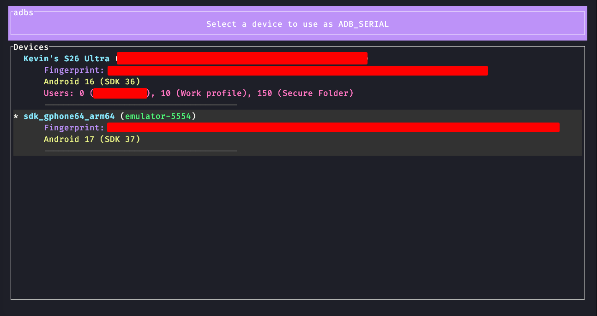

# adbs - Interactive ADB & Fastboot Device Selector & Shell Integration



`adbs` is a lightweight, real-time, interactive Android Debug Bridge (ADB) and Fastboot device selector written in Rust. It is built as a standalone, executable script using the Cargo script feature (`cargo +nightly -Zscript`), and can be compiled into a native, high-performance binary.

It features a rich, multi-line Terminal User Interface (TUI) built with `ratatui` and `crossterm` to display detailed device info in real-time, and integrates with your shell to set `ADB_SERIAL` globally.

## Features

- **ADB & Fastboot Support:** Real-time tracking and selection of devices in both ADB mode and Fastboot/Fastbootd modes, with the TUI split vertically into two sections.
- **Real-time Auto-Updating:** Listens to `adb track-devices` and periodically polls `fastboot devices` to dynamically update the UI when devices are connected or disconnected.
- **Asynchronous Loading:** Fetches device info (name, fingerprint, Android version, SDK level, user profiles, or Fastboot product details) in background threads, keeping the UI completely fluid and responsive.
- **Multi-User Profiles Support:** Identifies and lists multiple user accounts (e.g. Work profile, Secure Folder) installed on each ADB device dynamically inside the TUI.
- **Rich, Colored TUI:** Beautifully styled layout showing detailed properties at a glance.
- **Vim Keybindings:** Navigate lists and dialog buttons seamlessly using standard arrow keys or classic Vim keys (`h` / `j` / `k` / `l`).
- **Zero Telemetry:** Silenced Cargo build logs (`-q` flag) for a seamless, native-feeling CLI experience.

---

## Installation & Setup

Ensure you have Rust nightly installed (`rustup toolchain install nightly` if needed) to support cargo scripts and building.

### 1. Build & Install using Makefile

A `Makefile` is provided to compile the `adbs.rs` script into a release binary (`adbs-bin`) and install it to your system.

To build the release binary, run:
```bash
make
```

Then, install system-wide (defaults to `/usr/local/bin`):
```bash
sudo make install
```

> [!NOTE]
> Building first as a regular user ensures `cargo` runs within your user's configured environment, preventing `PATH` resolution issues when running under `sudo`.

To install to a user-specific directory (e.g., `~/.local/bin`):
```bash
make install PREFIX=~/.local
```

To uninstall:
```bash
sudo make uninstall
# Or for user-specific directory:
make uninstall PREFIX=~/.local
```

### 2. Shell Integration
Because a child process cannot modify your parent shell's environment variables, the `adbs` interactive TUI is rendered on `stderr`, allowing the parent shell wrapper to capture the selected device's serial directly from `stdout` without using any temporary files.

Add the appropriate snippet below to your shell startup profile:

#### For Zsh (`~/.zshrc`) or Bash (`~/.bash_profile` / `~/.bashrc`)
```bash
adbs() {
    # If installed to PATH via Makefile, you can just run the binary:
    local selection=$(adbs-bin "$@")
    
    # Handle environment variable updates
    if [ "$selection" = "__CLEAR__" ]; then
        unset ADB_SERIAL
        echo "Cleared ADB_SERIAL"
    elif [ -n "$selection" ]; then
        export ADB_SERIAL="$selection"
        echo "Active shell: ADB_SERIAL=$ADB_SERIAL"
    fi
}
```

#### For Nushell (`config.nu`)
```nushell
def --env adbs [] {
    # If installed to PATH via Makefile, you can just run the binary:
    let selection = (adbs-bin | str trim)

    # Handle environment variable updates
    if $selection == "__CLEAR__" {
        hide-env ADB_SERIAL
        print "Cleared ADB_SERIAL"
    } else if $selection != "" {
        $env.ADB_SERIAL = $selection
        print $"ADB_SERIAL set to ($selection)"
    }
}
def --wrapped adb [...args] {
    let has_serial_arg = ($args | length) > 0 and $args.0 == "-s"

    if ("ADB_SERIAL" in $env) and not $has_serial_arg {
        ^adb -s $env.ADB_SERIAL ...$args
    } else {
        ^adb ...$args
    }
}
```

---

## Usage

### Basic Run

Simply run the shell command:
```bash
adbs
```

Or execute the script directly if you preferred not to compile:
```bash
chmod +x adbs.rs
./adbs.rs
```

### Keyboard Controls

#### Device Selection List
| Key | Action |
| :--- | :--- |
| `Up` / `k` | Move selection cursor up |
| `Down` / `j` | Move selection cursor down |
| `Enter` | Select device and export `ADB_SERIAL` |
| `Esc` / `q` / `Ctrl+C` | Cancel selection (shows "Confirm Abort" modal if an active `ADB_SERIAL` is already set) |

#### Confirm Abort Modal (only active when ADB_SERIAL is set)
| Key | Action |
| :--- | :--- |
| `Left` / `Right` / `h` / `l` | Toggle between `[ Keep It ]` and `[ Clear ADB Serial ]` buttons |
| `Up` / `Down` / `j` / `k` | Toggle between `[ Keep It ]` and `[ Clear ADB Serial ]` buttons |
| `Enter` | Confirm the highlighted option |
| `Esc` / `q` / `Ctrl+C` | Cancel/default to keeping the current `ADB_SERIAL` and exit |
